<div align="center">

# 🚑 Metadata Crash Cart
### HFT-Style Telemetry & AI Forensic Pipeline

**A distributed, zero-latency observability pipeline for baremetal C++ applications — intercepting fatal kernel signals and diagnosing catastrophic failures in real time using a local LLM Vector Search (RAG) brain.**

[](#)
[](#)
[](#)

</div>

---

Built on principles borrowed from **High-Frequency Trading (HFT)** systems, this project demonstrates how to achieve **out-of-band telemetry** without mutexes, locks, or ever blocking the primary execution thread — while an AI forensic layer explains *why* things died, in plain English.

> This is a 100% backend system. There is no UI — **this README is the face of the project.**

---

## 📖 Table of Contents

- [System Overview](#-system-overview)
- [Architecture Deep Dive](#️-architecture-deep-dive)
  - [1. The C++ Producer (Hot Path)](#1-the-c-producer--the-hot-path)
  - [2. The Go Spy (Cold Path)](#2-the-go-spy--the-cold-path)
  - [3. The Python AI Forensic Brain](#3-the-python-ai-forensic-brain--rag-pipeline)
- [Interconnected System Architecture](#-interconnected-system-architecture)
- [The Wind Tunnel — Test Cases](#-the-wind-tunnel--test-cases)
- [Quick Start Guide](#-quick-start-guide)
- [Advanced: Hardcore Baremetal Tuning](#️-advanced-hardcore-baremetal-tuning-linux)

---

## 🔭 System Overview

The system is decoupled into **three isolated microservices**, each pinned to its own CPU core, communicating through a lock-free shared memory ring buffer instead of network sockets or message queues:

| Layer | Language | Role | CPU Core |
|---|---|---|---|
| 🔥 **Hot Path** | C++ | Trading engine emulator, writes telemetry at baremetal speed | Core 2 |
| 🕵️ **Cold Path** | Go | Silent out-of-band observer, detects failure signatures | Core 4 |
| 🧠 **Forensic Brain** | Python | RAG-based AI that maps failures to root cause | — |

---

## 🏗️ Architecture Deep Dive

### 1. The C++ Producer — The Hot Path

The trading engine emulator is built for absolute baremetal speed. It runs a **lock-free architecture**, writing data directly to physical RAM.

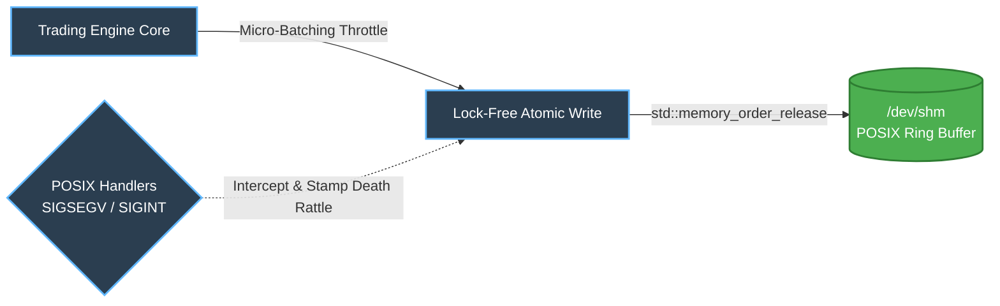

- **POSIX Signal Interception** — Catches fatal kernel signals (`SIGSEGV`, `SIGINT`) microseconds before the OS destroys the process, stamping a terminal **"death rattle"** (`0xDEAD000B`) into memory.
- **Lock-Free Atomics** — Uses `std::memory_order_release` to guarantee cross-core memory visibility without the overhead of traditional mutexes.
- **Micro-Batching** — Bypasses OS scheduler tick limits by processing bursts of transactions before yielding the thread, safely simulating **100k+ TPS**.

### 2. The Go Spy — The Cold Path

A concurrent telemetry observer pinned to its own CPU core. It silently reads the RAM left behind by the Producer without ever slowing it down.

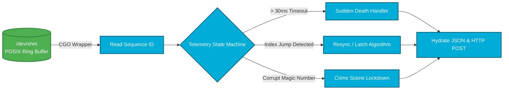

- **Variadic CGO Wrapper** — A custom C-shim safely bridges Go's compiler to the variadic Linux `open()` function for shared memory access.
- **Resilient Latching** — If the unthrottled C++ engine laps the Go Spy, Go dynamically calculates the dropped frames, fires a non-blocking alert, and latches onto the newest available index without crashing.
- **Heartbeat Monitor** — A 30ms timeout loop detects if the Producer was instantly vaporized by an **OOM killer**, even if no death rattle was left behind.

### 3. The Python AI Forensic Brain — RAG Pipeline

The diagnostics engine. It receives raw hex codes and telemetry context, cross-referencing them against historical Jira tickets and Slack alerts.

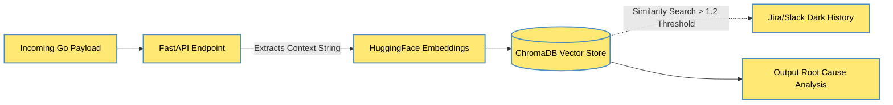

- **Semantic Vector Search** — Uses `all-MiniLM-L6-v2` embeddings via ChromaDB to map obscure hex codes to actionable, human-readable Root Cause Analyses (RCAs).
- **Anti-Hallucination Thresholding** — Enforces a strict mathematical distance threshold (`Distance > 1.2`) to explicitly label novel or unseen errors as `UNKNOWN` rather than hallucinating false fixes.

---

## 🌐 Interconnected System Architecture

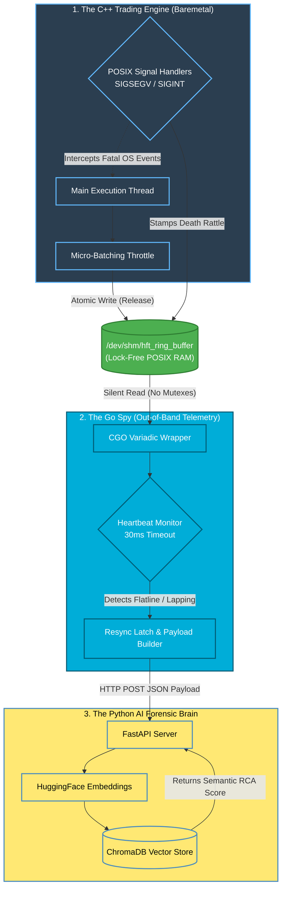

---

## 🌪️ The Wind Tunnel — Test Cases

To validate the architecture, the system was subjected to **four catastrophic failure simulations**.

<details open>
<summary><strong>1. The Lapping Test (CPU Starvation)</strong></summary>

**Fault:** Unthrottled Producer (50M+ TPS) outpaces the Observer.
**Result:** Go Spy detects the index mismatch, calculates dropped frames, and safely latches to the newest data. The AI maps the `WARNING_LAPPED` event to `Jira-802` (Core Pinning Resolution).

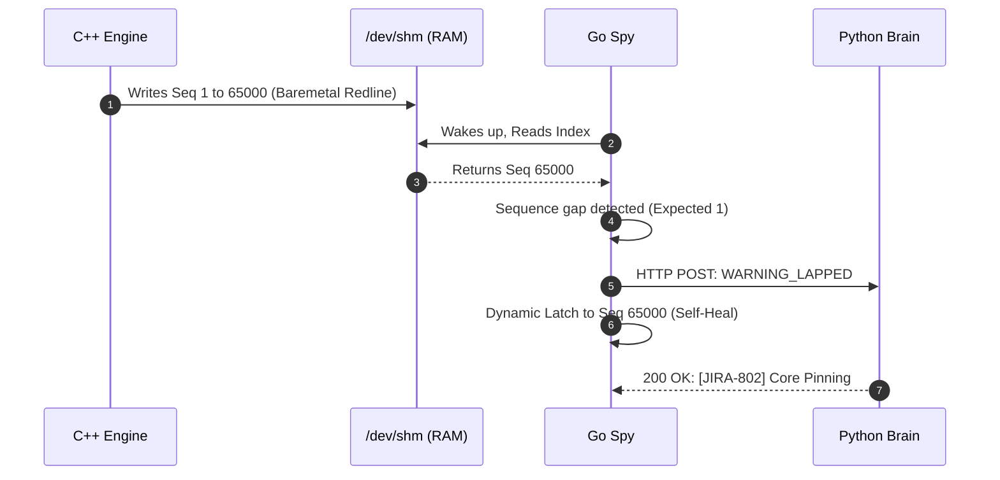


</details>

<details>
<summary><strong>2. The Corruption Test (Data Poisoning)</strong></summary>

**Fault:** A simulated RAM bit-flip intentionally writes `0xBADBAD` to the buffer.
**Result:** Go Spy detects the invalid magic number, executes a strict lockdown to preserve the memory state, and triggers `Jira-803` recommending a physical `memtest86`.

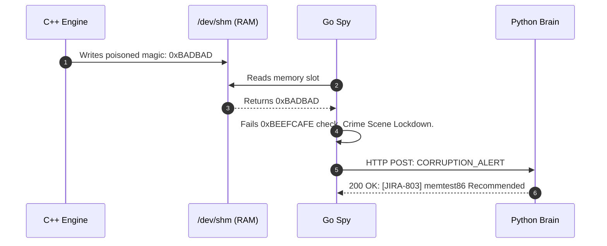

<p align="center">
  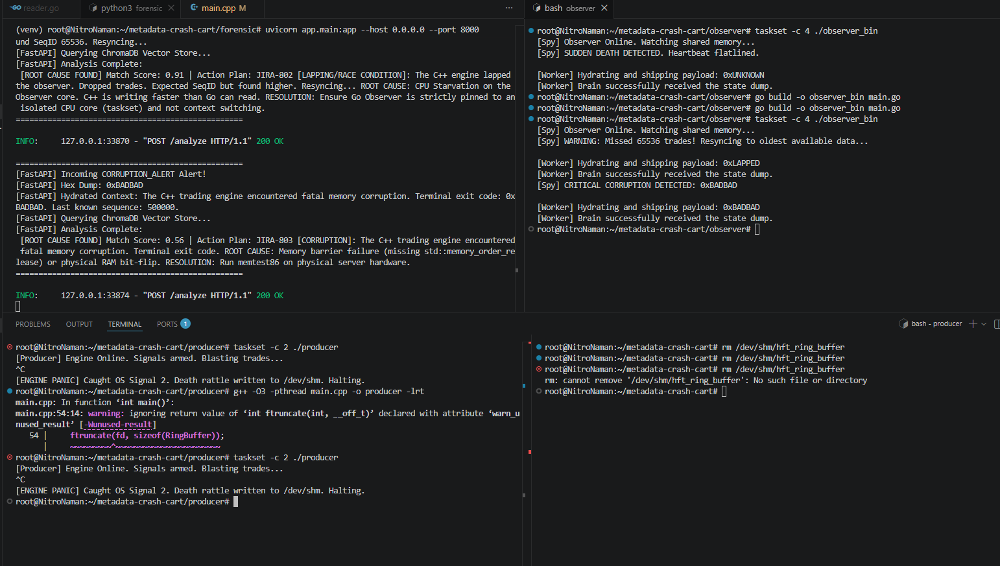
  <br>
  <sub><em>Live capture — Corruption alert propagating from Observer to Forensic Brain, resolved to JIRA-803</em></sub>
</p>

</details>

<details>
<summary><strong>3. The Dying Breath (Segmentation Fault)</strong></summary>

**Fault:** The C++ engine is assassinated via `kill -11` (`SIGSEGV`).
**Result:** The POSIX handler intercepts the kill command for a microsecond, stamps `0xDEAD000B`, and halts. Go maps the death rattle to `Jira-801` (Null Pointer Dereference).

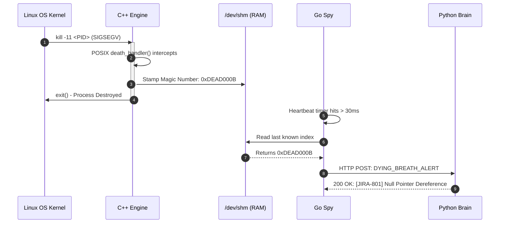

<p align="center">
  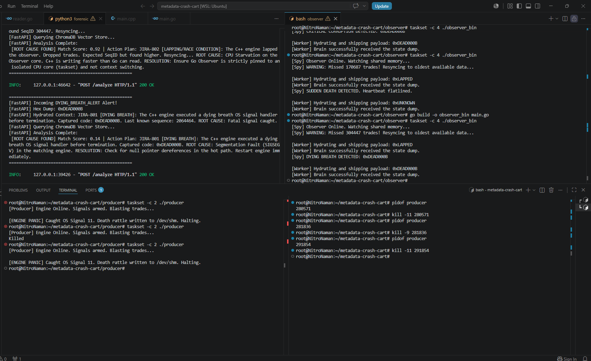
  <br>
  <sub><em>Live capture — SIGSEGV death rattle intercepted and mapped to JIRA-801</em></sub>
</p>

</details>

<details>
<summary><strong>4. Sudden Death (OOM Killer)</strong></summary>

**Fault:** The engine is hard-killed via `kill -9` (`SIGKILL`). No signal handlers are permitted to run.
**Result:** The Go Spy's 30ms heartbeat flatlines. It checks the RAM, finds a healthy magic number, realizes the process evaporated, and fires a `SUDDEN_DEATH` alert mapped to a Slack OOM notification.

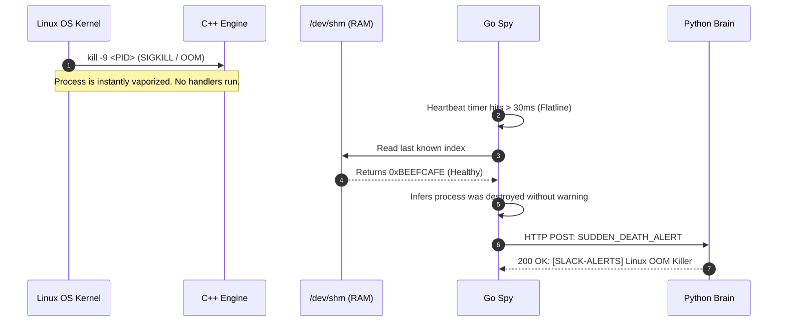

<p align="center">
  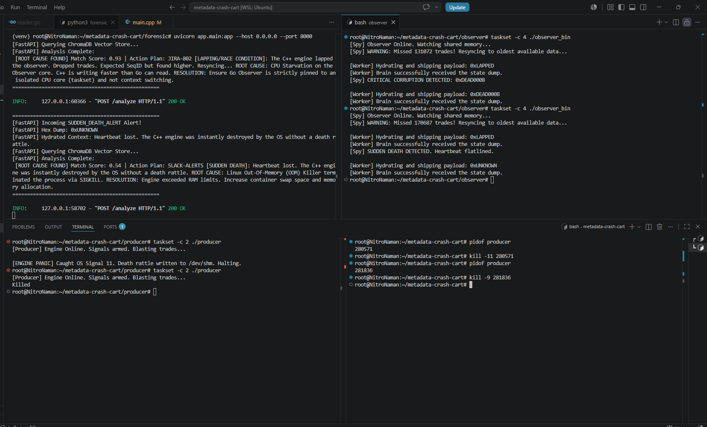
  <br>
  <sub><em>Live capture — Heartbeat flatline detected, SUDDEN_DEATH alert routed to Slack</em></sub>
</p>

</details>

### Summary

| # | Failure Mode | Trigger | Detected By | Outcome |
|---|---|---|---|---|
| 1 | **Lapping** | CPU starvation, 50M+ TPS | Sequence gap | `JIRA-802` Core Pinning |
| 2 | **Corruption** | RAM bit-flip / poisoned magic | Invalid magic number | `JIRA-803` memtest86 |
| 3 | **Dying Breath** | `SIGSEGV` (`kill -11`) | Death rattle stamp | `JIRA-801` Null Pointer |
| 4 | **Sudden Death** | `SIGKILL` / OOM (`kill -9`) | Heartbeat flatline | `SLACK-ALERTS` OOM Killer |

---

## 🚀 Quick Start Guide

**Prerequisites:** Linux/WSL, GCC, Go 1.20+, Python 3.10+

### 1. Boot the AI Brain (Terminal 1)

```bash
cd forensic
python3 -m venv venv
source venv/bin/activate
pip install -r requirements.txt
uvicorn app.main:app --host 0.0.0.0 --port 8000
```

### 2. Start the C++ Producer (Terminal 2)

Pinned to CPU Core 2 to isolate performance.

```bash
cd producer
g++ -O3 -pthread main.cpp -o producer -lrt
taskset -c 2 ./producer
```

### 3. Unleash the Go Spy (Terminal 3)

Pinned to CPU Core 4.

```bash
cd observer
go build -o observer_bin main.go
taskset -c 4 ./observer_bin
```

---

## ⚙️ Advanced: Hardcore Baremetal Tuning (Linux)

While `taskset` provides soft CPU affinity, true High-Frequency Trading systems require **OS-level isolation** to prevent the Linux kernel scheduler from introducing jitter. To achieve true baremetal performance, isolate the cores directly in the kernel boot parameters.

**1. Edit your GRUB configuration:**

```bash
sudo nano /etc/default/grub
```

**2. Append tuning parameters to `GRUB_CMDLINE_LINUX_DEFAULT`:**

Add `isolcpus`, `nohz_full`, and `rcu_nocbs` for Cores 2 and 4 (matching the producer and observer).

```bash
GRUB_CMDLINE_LINUX_DEFAULT="quiet splash isolcpus=2,4 nohz_full=2,4 rcu_nocbs=2,4"
```

| Parameter | Effect |
|---|---|
| `isolcpus=2,4` | Completely removes Cores 2 and 4 from the general SMP scheduler load balancing |
| `nohz_full=2,4` | Disables the adaptive kernel scheduler tick, eliminating OS interrupts during infinite polling loops |
| `rcu_nocbs=2,4` | Offloads Read-Copy-Update callbacks to other cores |

**3. Apply and reboot:**

```bash
sudo update-grub
sudo reboot
```

> After rebooting, the OS will entirely ignore Cores 2 and 4. You must explicitly inject the C++ and Go processes into those voided cores using `taskset -c 2` and `taskset -c 4`.

---

<div align="center">

Built for speed. Engineered for the crash. Diagnosed by AI. 🚑

</div>